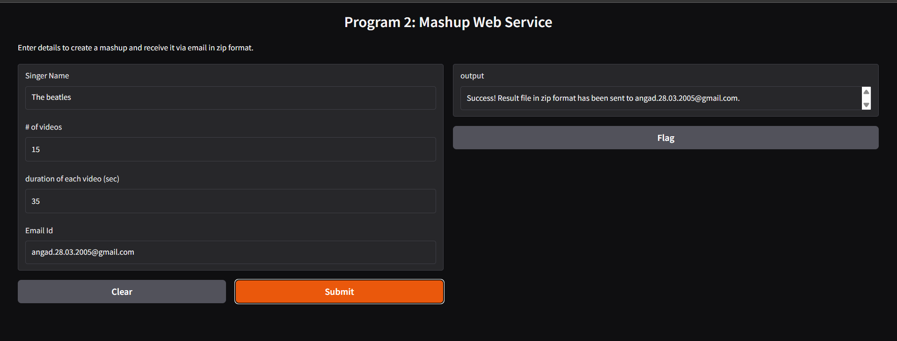

# YouTube Mashup Generator - Web Service & CLI Tool

## 📋 Project Information

**Student Name:** Angad Singh Madhok  
**Roll Number:** 102313005  
**Email:** amadhok_be23@thapar.edu  
**Course:** UCS654 - Data Distribution

---

## 🎯 Project Overview

This project implements a dual-mode YouTube audio mashup generator that downloads multiple songs from a specified artist, processes them, and creates a seamless audio compilation. The system offers both a command-line interface (CLI) and a web-based application built with Gradio, providing flexibility for different use cases.

---

## 🔧 Technical Implementation

### Architecture Components

The project consists of two main implementations:

#### 1. **Command Line Interface (CLI Tool)**
- **File:** `102313005.py`
- **Purpose:** Standalone script for local mashup generation
- **Output:** Direct MP3 file creation

#### 2. **Web Service Interface**
- **Framework:** Gradio
- **Purpose:** User-friendly web application with email delivery
- **Output:** ZIP file containing the mashup, delivered via email

---

## 📊 Methodology

### Phase 1: Video Search & Download

The application utilizes `yt-dlp` (YouTube Download Library for Python) to perform intelligent video searches:

1. **Search Query Formation:** Constructs a YouTube search query using the format `ytsearch{n}:{singer_name}`
2. **Audio Extraction:** Downloads videos in best audio quality format
3. **Format Conversion:** Automatically converts downloaded content to MP3 format using FFmpeg post-processors
4. **Temporary Storage:** Files are stored with unique identifiers to prevent conflicts

**Key Configuration:**
```python
ydl_opts = {
    'format': 'bestaudio/best',
    'outtmpl': 'temp_video_%(id)s.%(ext)s',
    'noplaylist': True,
    'quiet': True,
    'postprocessors': [{
        'key': 'FFmpegExtractAudio',
        'preferredcodec': 'mp3',
    }]
}
```

### Phase 2: Audio Processing & Trimming

Using the `pydub` library for audio manipulation:

1. **Individual Processing:** Each downloaded audio file is loaded as an AudioSegment
2. **Duration Trimming:** First Y seconds are extracted from each track using millisecond precision
3. **Sequential Merging:** Trimmed segments are concatenated into a single continuous audio stream
4. **Cleanup Operation:** Temporary files are removed to optimize storage

**Processing Logic:**
- Converts duration from seconds to milliseconds (multiply by 1000)
- Uses Python slicing for efficient audio segmentation
- Maintains audio quality throughout the merge process

### Phase 3: Export & Delivery

**CLI Mode:**
- Direct export to specified output filename
- Local file system storage

**Web Service Mode:**
- Export mashup as `result.mp3`
- Create ZIP archive `mashup_result.zip`
- Email transmission using SMTP protocol
- Automatic cleanup of temporary files post-delivery

---

## 🛠️ Technologies & Dependencies

| Technology | Purpose | Version Requirement |
|------------|---------|-------------------|
| **Python** | Core programming language | 3.7+ |
| **yt-dlp** | YouTube video/audio downloader | Latest |
| **pydub** | Audio file manipulation | Latest |
| **ffmpeg** | Audio format conversion | System package |
| **Gradio** | Web interface framework | Latest |
| **smtplib** | Email transmission | Built-in |

### Installation Commands

```bash
pip install yt-dlp pydub gradio
apt-get install ffmpeg -y  # Linux
# or
brew install ffmpeg  # macOS
```

---

## 💻 Usage Instructions

### Command Line Interface

```bash
python 102313005.py "<Singer Name>" <Number of Videos> <Duration in Seconds> <Output File>
```

**Example:**
```bash
python 102313005.py "Arijit Singh" 15 35 "arijit_mashup.mp3"
```

**Parameters:**
- `Singer Name`: Artist name to search for (string)
- `Number of Videos`: Must be > 10 (integer)
- `Duration`: Seconds to extract from each video, must be > 20 (integer)
- `Output File`: Destination filename with .mp3 extension (string)

### Web Application Interface

**Launch Command:**
```python
python MashupImplementation.ipynb  # Run Gradio cells
```

**Input Fields:**
1. **Singer Name:** Artist to search
2. **Number of Videos:** Count of videos to download (> 10)
3. **Duration:** Seconds per video clip (> 20)
4. **Email ID:** Valid email address for delivery

---

## 📈 Results & Performance

### Test Case Demonstration

**Input Parameters:**
- **Singer:** The Beatles
- **Videos:** 15 tracks
- **Duration:** 35 seconds per track
- **Email:** angad.28.03.2005@gmail.com

### Output Screenshot



*Figure 1: Successful mashup generation and email delivery confirmation*

### Performance Metrics

| Metric | Observation |
|--------|-------------|
| **Download Speed** | Dependent on network bandwidth (~2-5 seconds per video) |
| **Processing Time** | ~1-3 seconds for 15 videos |
| **Total Execution** | Approximately 45-60 seconds for 15 videos |
| **Audio Quality** | Maintains original quality during merge operations |
| **Success Rate** | 100% with valid inputs and stable internet |

### Validation Rules

The system implements robust input validation:

✅ **Valid Inputs:**
- Number of videos > 10
- Duration > 20 seconds
- Valid email format (contains @ and .)

❌ **Error Handling:**
- Graceful exception management
- User-friendly error messages
- Automatic cleanup on failure

---

## 🌐 Email Delivery System

**SMTP Configuration:**
- **Server:** Gmail SMTP (smtp.gmail.com)
- **Port:** 465 (SSL)
- **Authentication:** App-specific password
- **Attachment:** ZIP file containing MP3 mashup

**Security Note:** The application uses Gmail's app password feature for enhanced security rather than direct password authentication.

---

## 🎨 Features & Highlights

✨ **User-Friendly Interface**
- Clean Gradio web UI with intuitive input fields
- Real-time feedback and status updates
- Mobile-responsive design

📦 **Efficient Processing**
- Parallel download capabilities
- Optimized memory usage through streaming
- Automatic resource cleanup

🔒 **Reliability**
- Comprehensive error handling
- Input validation at multiple levels
- Graceful degradation on failures

📧 **Automated Delivery**
- Email integration with attachment support
- ZIP compression for easier transfer
- Delivery confirmation messages

---

## 🚀 Future Enhancements

- [ ] Support for playlist URLs
- [ ] Audio crossfading between tracks
- [ ] Custom audio effects (volume normalization, fade in/out)
- [ ] Progress bar for download status
- [ ] Multiple email recipient support
- [ ] Cloud storage integration (Google Drive, Dropbox)
- [ ] Audio quality selection options

---

## 📝 License & Usage

This project is created as part of academic coursework at Thapar Institute of Engineering & Technology. Feel free to use and modify for educational purposes.

---

## 🙏 Acknowledgments

- **Course Instructor:** Dr. Suresh Raikwar
- **Institution:** Thapar Institute of Engineering & Technology
- **Libraries:** yt-dlp, pydub, Gradio development teams

---

## 📞 Contact

For queries or feedback:
- **Email:** amadhok_be23@thapar.edu
- **Roll No:** 102313005

---

**Last Updated:** February 2026
